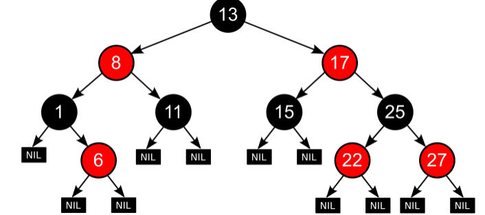
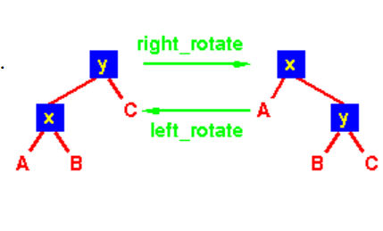
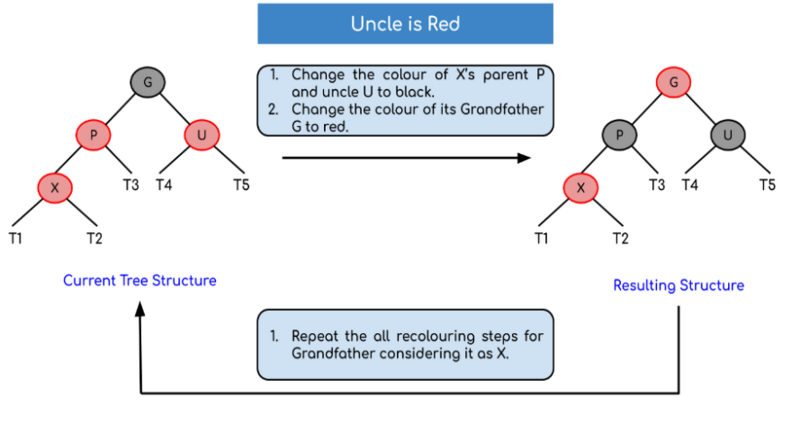
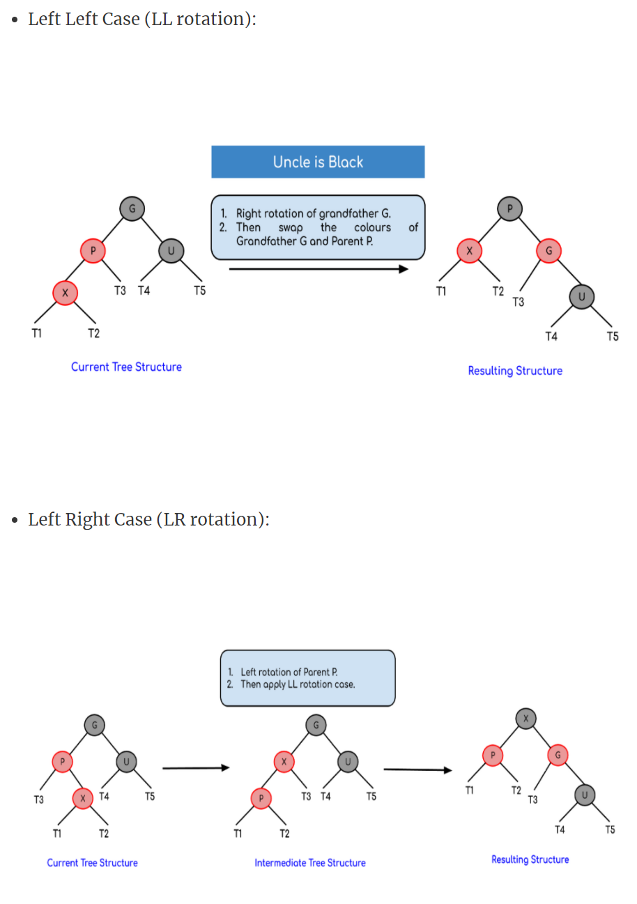
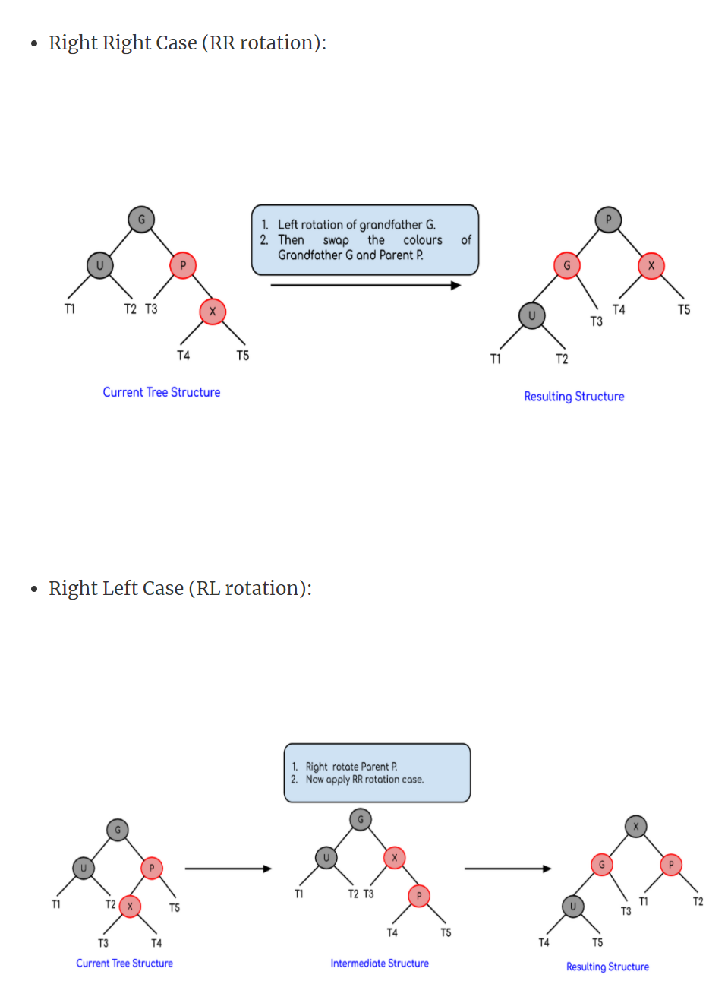

#红黑树

性质:
    
1. 节点要么黑色要么红色
2. 根节点是黑色
3. 红色节点的子节点是黑色
4. 叶子节点是黑色（空节点）
5. 从任一节点到叶子节点,黑色节点数目相同

插入:

预备知识:
以y为支柱右旋 以x为支柱左旋

如果树为空 则插入节点为黑色 作为根节点

如果树不为空 默认插入节点是红色 将插入节点作为当前节点x,
其父节点为p,叔叔节点为u,祖父节点为g,步骤如下
   
    
1. if p.colour == black 直接插入
    
2. else (p.colour==red)
   1.  u.colour==red
        
       
   2.  u.colour==black (前一个字母表示P在G的左边还是右边,
       后一个字母表示X在P的左边还是右边)
       LR case有错误, p下面是T3 T1 X下面是T2 左旋右旋看最上面的图 那个是对的
       其他case同样错误 另外 图中最开始的树就不是平衡的 所以旋转后还是不平衡 
       这里只是个例子

伪代码如下:

    void insertAndFix(Entry x){
        insert(x);
        if(x==root) x.colour==black; return;
        x.colour == red;
        while(x!=null&&x!=root&&x.parent.colour==red){
            后面的逻辑就是上面的 1.  u.colour==red....一直到最后
        }
        
       

删除！！！！(谁发明的 这是人干的事?):

先删除再平衡

步骤一:执行标准二叉搜索树的删除法
    
    回忆下对于二叉搜索树来说
    -----------------------------i am fengexian------------------
    如果删除的节点是叶子节点
              50                             50
           /     \         delete(20)      /   \
          30      70       --------->    30      70 
         /  \    /  \                   \    /  \ 
       20   40  60   80                    40  60   80
    如果删除的节点只有一个孩子 找到其中序遍历的后一个节点,替换要删除的节点,然后删除替换节点
    例如下面 将40替换30 就有40.right==40 删除后一个40
              50                            50
           /     \         delete(30)      /   \
          30      70       --------->    40     70 
            \    /  \                          /  \ 
            40  60   80                       60   80
    要删除的节点有两个孩子 同上 要到60 替换 50 删除原60 
               50                            60
           /     \         delete(50)      /   \
          40      70       --------->    40    70 
                 /  \                            \ 
                60   80                           80

这样不断递归删除,最后要解决的问题就是 

--最终删除一个节点，该节点要么是叶子要么只有一个孩子(此处说的叶子节点不是空节点,删除空节点无意义)

case 1:
    
    

    

参考:

    https://zh.wikipedia.org/wiki/%E7%BA%A2%E9%BB%91%E6%A0%91
    https://www.geeksforgeeks.org/red-black-tree-set-2-insert/amp/
    https://www.cs.auckland.ac.nz/software/AlgAnim/red_black_op.html
    https://www.cs.usfca.edu/~galles/visualization/RedBlack.html