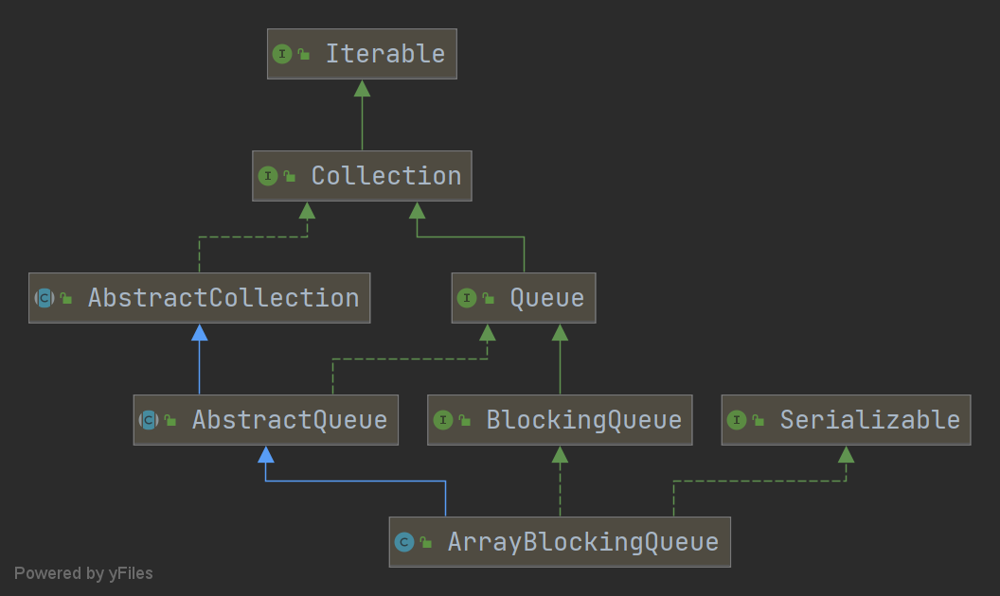
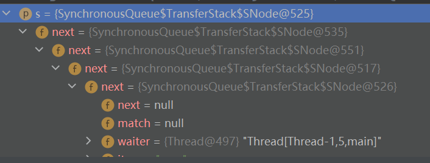

#BlockingQueue 未完待续

--------------------------
##ArrayBlockingQueue

前言---有界无界是指界限是否可以确定 

总体架构:

数据结构:

    
    final Object[] items;

    int takeIndex;

    int putIndex;

    int count;

    final ReentrantLock lock;

    private final Condition notEmpty;

    private final Condition notFull;

典型的生产者消费者模型,lock负责互斥,两个condition负责同步

    构造函数:
    public ArrayBlockingQueue(int capacity, boolean fair)
    默认非公平模式 需要传入初始容量 ,不可扩容

    offer:
    //可传入超时时间
    //offer put 区别就一点点
    public boolean offer(E e)
        final ReentrantLock lock = this.lock;
        try {
            while (count == items.length) {
                notFull.await();
            }
            enqueue(e);
            return true;
        } finally {
            lock.unlock();
        }
    }

    private void enqueue(E e) {
        // assert lock.isHeldByCurrentThread();
        // assert lock.getHoldCount() == 1;
        // assert items[putIndex] == null;
        final Object[] items = this.items;
        items[putIndex] = e;
        //将数组当成环形的
        if (++putIndex == items.length) putIndex = 0;
        count++;
        //唤醒一个
        notEmpty.signal();
    }
    出队一样的套路

    稍微总结一下
    进队: 获得锁 数组满了则返回false(也有超时返回模式) 否则放元素 
    放完后数组一定非空 所以唤醒一个消费者
    出队:同上

总结:
1. ArrayBlockingQueue不能扩容，因为是初始化时指定容量 所以传
入初始值时要拿捏好

2. ArrayBlockingQueue利用takeIndex和putIndex循环利用数组

3. 利用重入锁和两个条件保证并发安全,入队出队共用一把锁 效率低

4. 出队速度跟不上入队速度的话 线程会一直堵塞

##linkedBlockingQueue

-----------------------------------------

数据结构:

    单链表结构 
    static class Node<E> {
        E item;

        Node<E> next;

        Node(E x) { item = x; }
    }

    一把锁里面更新count肯定没问题 现在两把锁 更新count需要用原子类
    private final AtomicInteger count = new AtomicInteger();

    头节点 这是一个哨兵节点 不放元素
    transient Node<E> head;

    尾节点
    private transient Node<E> last;

    出队锁
    private final ReentrantLock takeLock = new ReentrantLock();

    用来控制队列非空时唤醒 空时阻塞
    private final Condition notEmpty = takeLock.newCondition();

    入队锁
    private final ReentrantLock putLock = new ReentrantLock();

    同上
    private final Condition notFull = putLock.newCondition();

实现:

    默认MAX＿VALUE大小
    public LinkedBlockingQueue() {
        this(Integer.MAX_VALUE);  
    }
    public LinkedBlockingQueue(int capacity) {
        if (capacity <= 0) throw new IllegalArgumentException();
        this.capacity = capacity;
        last = head = new Node<E>(null);
    }

    public void put(E e) throws InterruptedException {
        if (e == null) throw new NullPointerException();
        final int c;
        final Node<E> node = new Node<E>(e);
        final ReentrantLock putLock = this.putLock;
        final AtomicInteger count = this.count;
        putLock.lockInterruptibly();
        try {
            while (count.get() == capacity) {
                notFull.await();
            }
            enqueue(node);
            //c是count增加之前的值
            c = count.getAndIncrement();
            //这个步骤也可以让消费者线程来做 即每次消费完之后 都notFull.signal一下
            但是notfull.signal需要先获得put锁 这样性能会下降 既然现在已经获得了put锁
            为何不现在就试着唤醒自己人呢？(指生产者)
            if (c + 1 < capacity)
                notFull.signal();
        } finally {
            putLock.unlock();
        }
        
        if (c == 0)
            signalNotEmpty();
    }

    private void signalNotEmpty() {
        final ReentrantLock takeLock = this.takeLock;
        takeLock.lock();
        try {
            notEmpty.signal();
        } finally {
            takeLock.unlock();
        }
    }
    简单总结
    入队:获得putlock 判断队伍是否为满 满了就在notfull上等待 不满就入队 
    如果队伍还能放 则唤醒一个生产者线程  最后队伍为空时 尝试获得takeLock, 
    唤醒一个消费者线程(使用condition必须先获得对应的锁)
    出队一个套路
    

简单总结下
1. 两把锁 负责入队和出队
2. 也是有界队列 不传入初始值会启用最大int值
3. 单链表结构 不是双链表

##SynchronousQueue

-------------------------------------

简单介绍:
此队列能够以线程安全的方式在线程之间交换信息, take/put 两者都处于阻塞状态

例如 当队列中添加元素时 调用put（）方法 该方法将阻塞 直到其他线程调用take方法 表明已准备好接受元素

    默认非公平 使用transferstack 
    public SynchronousQueue(boolean fair) {
        transferer = fair ? new TransferQueue<E>() : new TransferStack<E>();
    } 
    TransferQueue TransferStack 代码太多不贴了 简单介绍如下
    （1）定义了一个抽象类Transferer 里面定义了一个传输元素的方法；

    （2）有两种传输元素的方法 一种是栈 一种是队列

    （4）栈只需要保存一个头节点就可以了 因为存取元素都是操作头节点 

    （5）队列需要保存一个头节点一个尾节点 因为存元素操作尾节点 取元素操作头节点 

    （6）每个节点中保存着存储的元素 等待着的线程 以及下一个节点

如上图 有五个生产者线程 每个线程都放一个字符串“now"  这五个线程都在阻塞 
直到有消费者线程来take数据 

transferStack 大致过程:

    top->node1 
    top->node2->node1
    top->node3->node2->node1
    
    node里面有个参数表明是取模式还是放模式 上面三个结点都是放模式 此时如果有个消费者线程来取数据 则尝试匹配栈顶结点中的线程 成功则不在阻塞
    node里面也有数据 所以严格意义上说还是有缓冲的
    另外入栈后线程还是自旋一会的 没有能匹配的消费者线程再休眠

transferQueue 是公平模式的 先阻塞的生产者线程优先匹配消费者线程
这两个内部都没有用来锁 全是volatile+cas操作完成的 

    放取元素使用同一个队列 队列中的节点具有两种模式 一种是数据节点 一种是非数据节点
    放元素时先跟队列头节点对比，如果头节点是非数据节点 就让他们匹配 如果头节点是数据节点 就生成一个数据节点放在队列尾端（入队）
    取元素时也是先跟队列头节点对比 如果头节点是数据节点 就让他们匹配 如果头节点是非数据节点 就生成一个非数据节点放在队列尾端（入队）

##PriorityBlockingQueue

---------------------------------

优先级队列 基本结构:

    private static final int DEFAULT_INITIAL_CAPACITY = 11;

    /**
     * The maximum size of array to allocate.
     * Some VMs reserve some header words in an array.
     * Attempts to allocate larger arrays may result in
     * OutOfMemoryError: Requested array size exceeds VM limit
     */
    private static final int MAX_ARRAY_SIZE = Integer.MAX_VALUE - 8;

    /**
     * Priority queue represented as a balanced binary heap: the two
     * children of queue[n] are queue[2*n+1] and queue[2*(n+1)].  The
     * priority queue is ordered by comparator, or by the elements'
     * natural ordering, if comparator is null: For each node n in the
     * heap and each descendant d of n, n <= d.  The element with the
     * lowest value is in queue[0], assuming the queue is nonempty.
     */
    private transient Object[] queue;

    /**
     * The number of elements in the priority queue.
     */
    private transient int size;

    /**
     * The comparator, or null if priority queue uses elements'
     * natural ordering.
     */
    private transient Comparator<? super E> comparator;

    /**
     * Lock used for all public operations.
     */
    private final ReentrantLock lock = new ReentrantLock();

    /**
     * Condition for blocking when empty.
     */
    private final Condition notEmpty = lock.newCondition();

    /**
     * Spinlock for allocation, acquired via CAS.
     */
    private transient volatile int allocationSpinLock;

    简单总结下
    依然是使用一个数组来使用元素
    使用一个锁加一个notEmpty条件来保证并发安全 
    没有notfull因为可以扩容 容量超过最大值会报错 扩容时<64时每次*2 >64时每次*1.5
    使用一个变量的CAS操作来控制扩容 每次只有一个线程可以进程扩容(concurrentHashMap扩容其他线程一起来帮忙)
    进队出队就是加了锁的PriorityQueue
    
    

##LinkedTransferQueue

------------------------

LinkedTransferQueue实现了TransferQueue接口, 就是上面synQueue那里面的

    private transient volatile Node tail;
    transient volatile Node head;
    private static final int NOW   = 0; // for untimed poll, tryTransfer
    private static final int ASYNC = 1; // for offer, put, add
    private static final int SYNC  = 2; // for transfer, take
    private static final int TIMED = 3; // for timed poll, tryTransfer

    static final class Node {
        final boolean isData;   // false if this is a request node
        volatile Object item;   // initially non-null if isData; CASed to match
        volatile Node next;
        volatile Thread waiter;
    }
    方法过程跟synQueue里面差不多 多了now asy syn timed这些逻辑 基本原理不变 同样没有用到锁 全是CAS操作
    和park unpark来控制
    不管是取元素还是放元素都会入队 
    先尝试跟头节点比较 如果二者模式不一样 就匹配它们 组成CP 然后返回对方的值
    如果二者模式一样 就入队 并自旋或阻塞等待被唤醒
    对于入队之后 先自旋一定次数后再调用LockSupport.park()或LockSupport.parkNanos阻塞

##DelayQueue

-------------------------------

DelayQueue组合了一个叫做Delayed的接口 DelayQueue中存储的所有元素必须实现Delayed接口

    private final transient ReentrantLock lock = new ReentrantLock();
    private final PriorityQueue<E> q = new PriorityQueue<E>();
    //等待堆顶的线程
    private Thread leader;

    /**
     * Condition signalled when a newer element becomes available
     * at the head of the queue or a new thread may need to
     * become leader.
     */
    private final Condition available = lock.newCondition();
    
    入队:加锁 -> 添加元素到优先级队列中 -> 如果添加的元素是堆顶元素 就把leader置为空 
    并唤醒等待在条件available上的线程 ->解锁
    出队:加锁 判断堆顶元素是否为空 是则直接阻塞等待
    判断是否到期 到期了poll出元素
    没到期则等待 
    

    
    