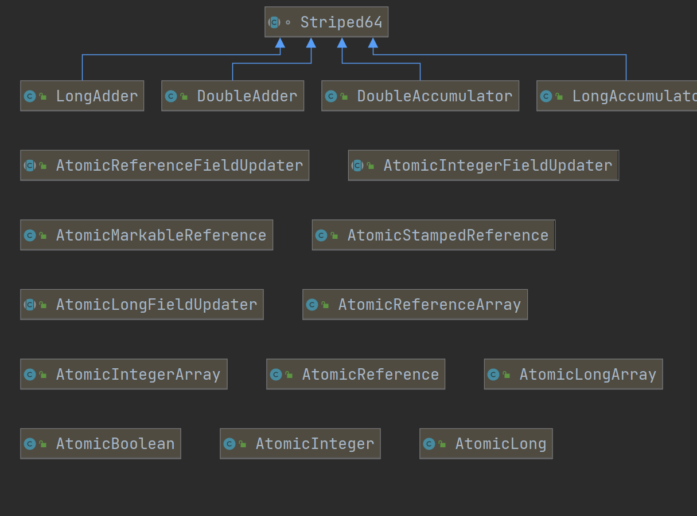

#java.util.concurrent.atomic包

-------------------------------------------------

1.unsafe类

    concurrent包的基石
    Unsafe提供了访问底层的机制 一般使用方法为获取类中某个字段的地址 
    然后用Unsafe类修改
    例如 unsafe.putInt(user,unsafe.objectFieldOffset(age),20);

    另外可以用来分配堆外内存 但是需要调用freeMemory()方法手动释放它
    address=unsafe.allocateMemory(size*INT);

    Unsafe的CompareAndSwapXXX()方法 CAS操作

2.AtomicInteger 

    原子类的一种 主要操作的是int类型的整型 通过调用底层Unsafe的CAS等方法实现原子操作
    
    实现
    // setup to use Unsafe.compareAndSwapInt for updates
    private static final Unsafe unsafe = Unsafe.getUnsafe();
    private static final long valueOffset;

    static {
        try {
            valueOffset = unsafe.objectFieldOffset
                (AtomicInteger.class.getDeclaredField("value"));
        } catch (Exception ex) { throw new Error(ex); }
    }

    private volatile int value;

    public final int getAndIncrement() {
        return unsafe.getAndAddInt(this, valueOffset, 1);
    }

    public final int getAndAddInt(Object o, long offset, int delta) {
        int v;
        do {
            v = getIntVolatile(o, offset);
        } while (!compareAndSwapInt(o, offset, v, v + delta));
        return v;
    }
    

3.AtomicStampedReference

    在AtomicInteger基础上加了邮戳
    实现
    private static class Pair<T> {
        final T reference;
        final int stamp;
        private Pair(T reference, int stamp) {
            this.reference = reference;
            this.stamp = stamp;
        }
        static <T> Pair<T> of(T reference, int stamp) {
            return new Pair<T>(reference, stamp);
        }
    }

    private volatile Pair<V> pair;

    将值和邮戳封装成一个Pair 

     public boolean compareAndSet(V   expectedReference,
                                 V   newReference,
                                 int expectedStamp,
                                 int newStamp) {
        Pair<V> current = pair;
        return
            expectedReference == current.reference &&
            expectedStamp == current.stamp &&
            ((newReference == current.reference &&
              newStamp == current.stamp) ||
             casPair(current, Pair.of(newReference, newStamp)));
    }

    private boolean casPair(Pair<V> cmp, Pair<V> val) {
        return UNSAFE.compareAndSwapObject(this, pairOffset, cmp, val);
    }

    首先，使用版本号控制；其次，不重复使用节点（Pair）的引用，每次都新建一个新的Pair来作为CAS比较的对象，
    而不是复用旧的；最后，外部传入元素值及版本号，而不是节点（Pair）的引用。

3.LongAdder 

    先看Striped64 类 
    仅支持原始访问和 CAS 的 AtomicLong 的填充变体
    如果提供了CAS 则可以在此处使用仅发布形式的CAS

    @sun.misc.Contended static final class Cell {
        volatile long value;
        Cell(long x) { value = x; }
        final boolean cas(long cmp, long val) {
            return UNSAFE.compareAndSwapLong(this, valueOffset, cmp, val);
        }

        // Unsafe mechanics
        private static final sun.misc.Unsafe UNSAFE;
        private static final long valueOffset;
        static {
            try {
                UNSAFE = sun.misc.Unsafe.getUnsafe();
                Class<?> ak = Cell.class;
                valueOffset = UNSAFE.objectFieldOffset
                    (ak.getDeclaredField("value"));
            } catch (Exception e) {
                throw new Error(e);
            }
        }
    }

    Contented表示是表示用了填充的(避免伪共享) 需加参数 -XX:-RestrictContended才会开启
    
    
    /** Number of CPUS, to place bound on table size */
    static final int NCPU = Runtime.getRuntime().availableProcessors();

    /**
     * Table of cells. When non-null, size is a power of 2.
     */
    transient volatile Cell[] cells;

    /**
     * Base value, used mainly when there is no contention, but also as
     * a fallback during table initialization races. Updated via CAS.
     */
    transient volatile long base;

    /**
     * Spinlock (locked via CAS) used when resizing and/or creating Cells.
     */
    transient volatile int cellsBusy;

    原理是分布地计算值
    
    longAdder中的方法
    public void add(long x) {
        Cell[] as; long b, v; int m; Cell a;
        //如果cells为空 且casBase一次搞定 则不会走下面的逻辑
        if ((as = cells) != null || !casBase(b = base, b + x)) {
            boolean uncontended = true;
            //如果有竞争得启动加速计算操作
            if (as == null || (m = as.length - 1) < 0 ||
                (a = as[getProbe() & m]) == null ||
                !(uncontended = a.cas(v = a.value, v + x)))
                longAccumulate(x, null, uncontended);
        }
    }

    uncontended意思是无竞争的 此处为true表示竞争不激烈 并不是完全无竞争的意思
    
    //究极复杂。。。。。
    final void longAccumulate(long x, LongBinaryOperator fn,
                              boolean wasUncontended) {
        int h;
        if ((h = getProbe()) == 0) {
            ThreadLocalRandom.current(); // force initialization
            h = getProbe();
            wasUncontended = true;
        }
        boolean collide = false;                // True if last slot nonempty
        for (;;) {
            Cell[] as; Cell a; int n; long v;
            if ((as = cells) != null && (n = as.length) > 0) {
                if ((a = as[(n - 1) & h]) == null) {
                    if (cellsBusy == 0) {       // Try to attach new Cell
                        Cell r = new Cell(x);   // Optimistically create
                        if (cellsBusy == 0 && casCellsBusy()) {
                            boolean created = false;
                            try {               // Recheck under lock
                                Cell[] rs; int m, j;
                                if ((rs = cells) != null &&
                                    (m = rs.length) > 0 &&
                                    rs[j = (m - 1) & h] == null) {
                                    rs[j] = r;
                                    created = true;
                                }
                            } finally {
                                cellsBusy = 0;
                            }
                            if (created)
                                break;
                            continue;           // Slot is now non-empty
                        }
                    }
                    collide = false;
                }
                else if (!wasUncontended)       // CAS already known to fail
                    wasUncontended = true;      // Continue after rehash
                else if (a.cas(v = a.value, ((fn == null) ? v + x :
                                             fn.applyAsLong(v, x))))
                    break;
                else if (n >= NCPU || cells != as)
                    collide = false;            // At max size or stale
                else if (!collide)
                    collide = true;
                else if (cellsBusy == 0 && casCellsBusy()) {
                    try {
                        if (cells == as) {      // Expand table unless stale
                            Cell[] rs = new Cell[n << 1];
                            for (int i = 0; i < n; ++i)
                                rs[i] = as[i];
                            cells = rs;
                        }
                    } finally {
                        cellsBusy = 0;
                    }
                    collide = false;
                    continue;                   // Retry with expanded table
                }
                h = advanceProbe(h);
            }
            else if (cellsBusy == 0 && cells == as && casCellsBusy()) {
                boolean init = false;
                try {                           // Initialize table
                    if (cells == as) {
                        Cell[] rs = new Cell[2];
                        rs[h & 1] = new Cell(x);
                        cells = rs;
                        init = true;
                    }
                } finally {
                    cellsBusy = 0;
                }
                if (init)
                    break;
            }
            else if (casBase(v = base, ((fn == null) ? v + x :
                                        fn.applyAsLong(v, x))))
                break;                          // Fall back on using base
        }
    }

    拆开来看
    前面就是初始线程的probe值 用来定位线程要更新cells中的哪个cell
    if ((as = cells) != null && (n = as.length) > 0){...}
    else if (cellsBusy == 0 && cells == as && casCellsBusy()){...}
    else if (casBase(v = base, ((fn == null) ? v + x :
                                        fn.applyAsLong(v, x))))
                break; 

    第一个if判断如果cells不为空 且 cells长度大于0
    第二个if判断cellsBusy锁为0 即cells未在创建或者扩容 且 当然cells状态一致 且加锁成功
    第三个if判断如果有其它线程在初始化cells数组中 就尝试更新base 如果成功了就返回
    
    只有一个cellsBusy锁 一旦一个线程上锁了 其他线程添加cell只能等

    第一个if中主要是定位到对应的cell 
    1.如果cell未初始化且锁空闲 就初始化并加锁替换
    2.如果cell初始化 则cas cell中的值  成功就将整个for循环break
    3.如果上步也失败了 则判断cells的长度是不是大于cup个数了(准确的说是在当前类初始化的时候
    static final int NCPU = Runtime.getRuntime().availableProcessors();)
    4.如果上部分小于 则扩容 x2  continue;
    h = advanceProbe(h);这行触发只有上面2 4成功了才不会触发
    否则 修改probe 让当前线程定位到别的cell试试吧

    第二个if主要是初始化cells的
    加锁 Cell[] rs = new Cell[2]; rs[h & 1] = new Cell(x);

    第三个就是碰运气咯 cells全不行 那我试试base能不能更新咯

    public long sum() {
        Cell[] as = cells; Cell a;
        long sum = base;
        if (as != null) {
            for (int i = 0; i < as.length; ++i) {
                if ((a = as[i]) != null)
                    sum += a.value;
            }
        }
        return sum;
    }

    求sum 这个显然不是实时一致性的 试想当前加到第3个cell 但是第二个cell更新了
    凉凉 但是是最终一致性的 

4.原子包共13个大类

    
最上面的是高性能原子类
下面普普通通 原理都是用unsafe获取字段地址 然后更新 

    

    