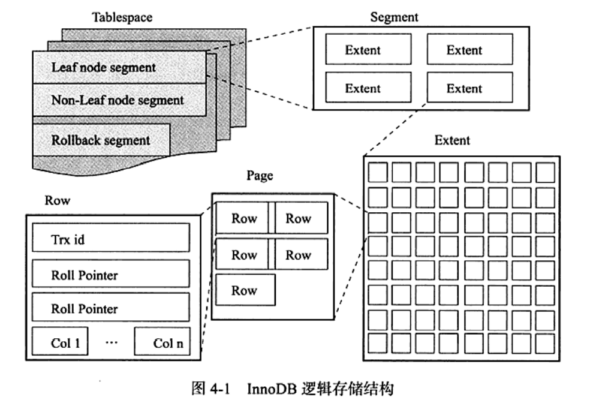

#基础知识

--------------------------------

checkpoint

    目的:
    缩短数据库的恢复时间 
    缓冲池不够用时 将脏页刷新到磁盘
    重做日志不可用时 刷新脏页
    宕机时 checkpoint 之前的页都刷回到磁盘了 只用重做checkpoint之后的

    两种checkpoint
    sharp checkpoint 数据库关闭时 将所有的脏页刷新到磁盘
    fuzzy checkpoint 数据库运行时使用 只刷新一部分脏页

    fuzzy checkpoint又分为
    master thread 每秒或每十秒刷新一定比例的脏页到磁盘 异步 
    flush_lru_list checkpoint 需要保证LRU列表中有1024(默认)个空闲页 
    不够则需要从尾部刷新脏页
    async flush checkpoint 
    sync flush checkpoint 这两个都是重做日志不可重时启用 强制将一些页刷新回磁盘
    dirty page too much 脏页太多 innodb_max_dirty_pages_pct = ? 启用 

    
Master Thread:

    1.0x版本之前
    由多个循环组成-master loop,background loop, flush loop,suspend loop
    在这些loop中来回切换    

    master loop里面有:
    每秒一次的操作---
    日志缓冲刷新到磁盘 即使事务未提交(总是)下面的可能执行
    合并插入缓冲
    至多刷新100个脏页(一页16k跟操作系统那个4k的不一样）
    若无活动切换到background loop

    每10秒一次:
    刷新100脏页(可能)下面的总是执行
    日志刷新
    删除无用Undo
    刷新100或10个
    合并至多5个插入缓存

    background loop 里面合并插入缓冲 删除无用Undo 刷新页 

    以上刷新脏页需要看脏页数占比是否超过了innodb_max_dirty_pages_pct 

    1.0x版本之后的优化也都是围绕上面这些来的 留个坑先

插入缓冲(insert buffer):

    使用条件:
    索引是辅助索引 索引不是唯一的
    对于非聚集索引的插入或更新 不是每一次都直接插入到索引页里 而是先判断是不是在缓冲池中
    在的话直接插入 不在的话放在一个insert buffer对象里 在一定的频率将多个插入合并到一个
    操作里 提高性能。 大白话讲就是这些个索引都不同的页中  来了先攒一攒 挑索引在一个页的一起
    插入 

    缺点:攒太多了还没插入呢 宕机了。。。。。

##文件

-------------------------------------

参数文件

    命令 mysql --help | grep my.conf 
    
日志文件

    error log 命令 show variables like 'log_error'
    binlog slow query log log(查询日志)
    
慢查询日志

    mysql启动时有一个阈值 运行时间超过此阈值的sql语句都记录到慢查询日志中 
    long_query_time 默认为10秒
    log_queries_not_using_indexs =on时 表示sql语句未使用索引会被记录
    msyqldumpslow 分析慢查询日志
    例如执行时间最少的10条SQL语句 mysqldumpslow -s al -n 10 XXX.log(日志名)
    5.1版本起 慢查询日志可以放到slow_log这个表里
    日志中逻辑读取是指读磁盘 物理读取是指读内存

binary log 

    记录所有更改操作(update delete insert) 默认不启动 启动会影响大概1%的性能
    作用: 恢复数据 主从复制 审计(判断是否有注入攻击) 
    sync_binlog 表示每写缓冲多少次就同步到磁盘 
    slave 不会将master 中取得并执行的binlog写入到自己的binlog中 要使用主-从-从模式
    需要设置log_slave_update 
    
    binlog_format 设置格式 总共三种格式
    statement 只记录sql语句
    row row格式会记录行的内容 更新前和更新后
    mixed 混合模式
    

表空间文件

    数据按表空间存放 可以设置使用哪些文件组成表空间 比如/db/ibdate1  /dr2/db/ibdate2
    表空间文件记录表空间的一些元数据信息

redo log file

    首先与binlog的区别
    首先 REDO日志是在InnoDB存储引擎层生成的 Binlog是在MySQL数据库的上层(整个Mysql架构的上层)生成的 
    并且binlog不仅是针对InnoDB存储引擎的 MySQL数据库中的任何存储引擎都将具有binlog 用于记录更改
    第二 形式不同 binlog是一个逻辑日志 它的记录是相应的SQL语句  InnoDB存储引擎级别的redo是物理日志
    (记录该数据页更新的内容)
    redo log是循环写 日志空间大小固定 binlog是追加写 
    binlog可以作为恢复数据使用 主从复制搭建 redo log作为异常宕机或者介质故障后的数据恢复使用。
    这两个日志与将记录写入磁盘的点不同 对于binlog 所有未提交的语句都记录在一个缓存中 提交的时候
    一次性写入到Binlog中

    mysql通过WAL(write-ahead logging)技术保证事务
    在同一个事务中 每当数据库进行修改数据操作时 将修改结果更新到内存后 
    会在redo log添加一行记录记录“需要在哪个数据页上做什么修改” 并将该记录状态置为prepare 
    等到commit提交事务后  会将此次事务中在redo log添加的记录的状态都置为commit状态 之后将修改落盘时
    会将redo log中状态为commit的记录的修改都写入磁盘

    redolog的大小是固定的  在mysql中可以通过修改配置参数innodb_log_files_in_group和innodb_log_file_size
    配置日志文件数量和每个日志文件大小 采用循环写的方式记录 当写到结尾时会回到开头循环写日志

    写入顺序:
    先写入一个redo log buffer中 然后按照一定的条件 顺序的写入到磁盘中
    触发条件是 每秒将缓冲写到磁盘(无论事务提交与否) 
    另外事务提交时 有两种情况 一种是立即刷新 一种是等主线程刷新(每秒一次这种)

##表

---------------------------------

索引组织表

    innodb中 表都是按照主键顺序组织存放的 每个表有个主键 如果没有显示创建主键
    则会 首先判断是否有非空的唯一索引 有的话即为主键(题外话 主键可以不止一列)
    没有的话 自动创建一个6字节大小的指针 

表空间

    默认共用一个表空间 可以开启多个表空间 则每个表的数据都在不同的表空间中 但是还是有一个
    共享表空间 用于放别的信息(比如undo等)

##索引与算法

--------------------------------------

索引

    Innodb创建辅助索引时对表加s锁 只能读 对主键索引的创建和删除需要重新建表

    
    数据库的应用分两类 一种是OLTP在线事务处理 如电子商务 游戏等 另一类是OLAP在线分析处理 
    如数据仓库 数据集市
    对于典型OLTP应用的查询语句 如根据订单号取得订单 建立索引是很有意义的
    对于OLAP 一般对时间字段建立索引

    索引覆盖:从辅助索引中就可以得到查询的记录 对于联合索引(a,b) 一般不可以选择b中的查询条件
    但是如果有统计操作 并且是覆盖索引的 还是会选择(a,b)的

    对于可选索引有好几个的 确定使用一个索引而不用优化器自己优化的 使用force index() 可以节省
    优化器执行时间

cardinality

    并不是所有的查询条件中出现的列都需要添加索引 在访问表很小一部分时使用索引才有
    有意义 对于低选择性的字段 如性别 地区等 添加索引完全没有必要    
    对于高选择性的字段(几乎没有重复)有必要建立索引 通过show index 结果中的 cardinality
    来判读 它表示索引中不重复记录数量的预估值
    内部通过采样方式获取cardinality值 因此这个值才是预估值

MRR优化
    
    MRR优化是指通过辅助索引查到主键后放到一个缓冲区中对主键进行排序后再查找
    还会将范围查询拆为键值对 比如查询 1000<a<2000 b=1000
    会拆为 (1000 1000) (1001,1000) 等

ICP优化

    取出索引的同时判断是否可以过滤 而不是取出记录再过滤

锁

    S锁 X锁 只有S与S兼容 

    意向锁(表级别)
    意向共享锁 想要获得一张表中某几行的共享锁
    意向排他锁 
    只会阻塞全表扫描

一致性非锁定读

    即读数据时 如有x锁 则读历史版本
    对于read committed级别 读最新的历史快照
    对于repeatable committed 读事务开始时的行数据版本

    默认读不加锁 使用一致性非锁定读
    select for update 加 x锁
    select lock in share mode 加s锁

自增长

    插入类型
    insert like  所有
    simple inserts 确定行数的插入
    bulk inserts 不确定行数的插入
    mixed-mode inserts 混合
    
    innodb_atomic_lock_mode
    0 1 2
    0已不再用  1默认 simple inserts用互斥量更新计数器 bulk insert 用auto-inc locking    
    2 对所有插入都用互斥量更新计数器

锁的算法

    record lock 单个行记录上的锁
    gap lock 锁定一个范围 不包括记录本身
    next-key lock 锁定一个范围且锁定记录

    当查询的索引是主键时 对next-key lock降级为record lock
    假如一个索引值为    10 11 13 20 则next-key lock范围为负无穷到10
    10-11 11-13 13-20 20-
    另外 还会对辅助索引下一个键值加gap lock 
    例如索引值 a 为 1 3 6 9
    则next-key lock若是 1-3 gap-lock 则为 3-6

    简而言之就是
    对于索引的扫描 不仅是锁住扫描到的索引 还锁住这些索引覆盖的范围 用来避免不可重复读

死锁

    一是将所有的等待都回滚
    二是 按照FIFO顺序超时回滚 innodb_lock_wait_timeout 用来设置超时的时间
    缺点是事务太大的话 就要回滚较长时间

    三是wait for graph的方式用来进行死锁检测 以锁的信息链表和事务等待链表
    构成一张有向图 图中若存在回路就代表死锁 图的结点是一个个事务 边为事务等待另一事务
    每个事务请求锁并发生等待时都会判断是否存在回路 若存在则有死锁 然后选择回滚undo量
    最小的事务
    

##备份

----------------------------

冷备份

    备份frm文件 共享表空间文件 独立表空间文件 重做日志文件
    备份文件太大 不容易跨平台

逻辑备份

    mysqldump命令 备份的文件为导出的SQL语句
    不能导出视图

热备份

    