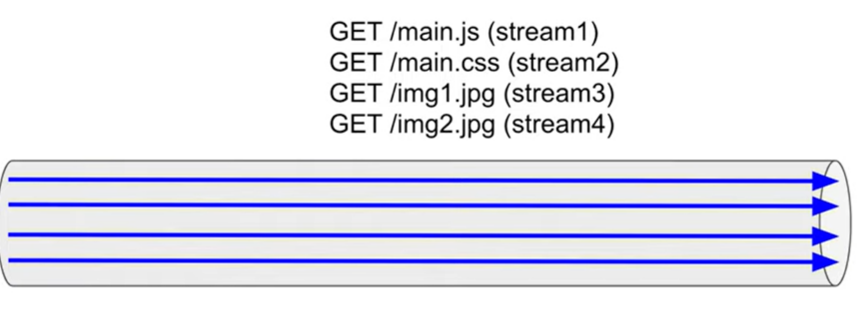
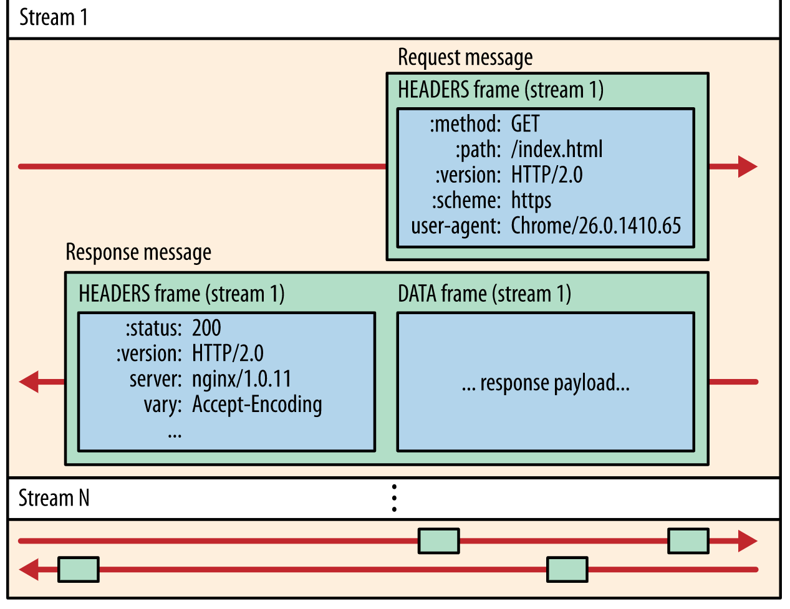
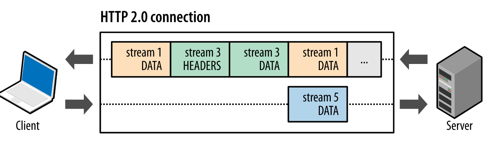
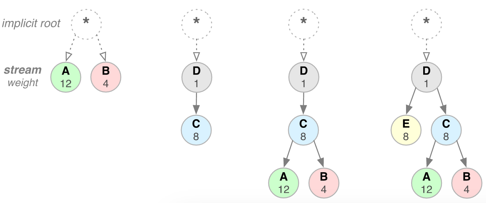
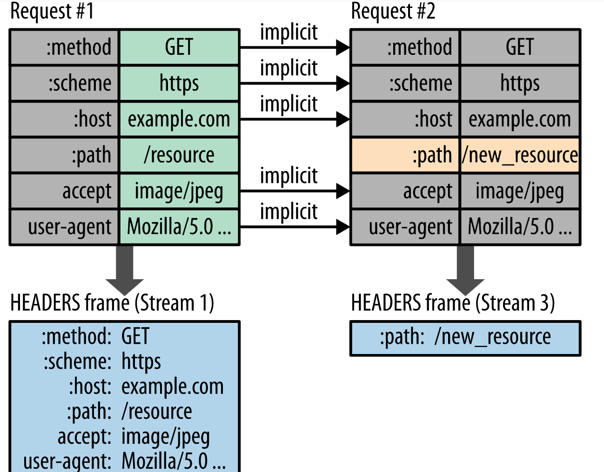

#HTTP 

基本信息:

    以1.0发送为例
    get http://......  HTTP/1.0
    user-agent:.....
    host:.....
    connection:....... =close时 一次http请求后连接就要关闭 每次都要重新
    连接(新的tcp连接) 浪费资源 还慢

    请求方法:
    get 请求资源 head 只请求头部  post 提交数据 put 上传资源
    delete 删除资源 trace 返回http请求的内容 options 查看支持的请求方法
    patch 对某个资源做部分修改
    put delete head get options 幂等 即多次连续的重复的请求和一次请求具
    有完全相同的效果 post 不是
    

状态码

    

HTTP 1:

    简单 但是无连接 无状态  不复用tcp连接 开一个网页10个资源就要发10次http请求 
    总共10个tcp连接  速度慢 延迟高

HTTP1.1
    
    在1.0的基础上加了connection:keep-alive 可以复用tcp连接 上面10个http对同一个
    目的主机的请求可以共同用一个tcp连接 但是http请求/响应串行的 在当前请求没有结束之前 
    其他的请求只能处于被阻塞的状态
    Chrome默认在同一个域名下允许同时建立6个TCP持久连接 但是问题没有得到本质的解决

    网页中的图片资源为什么分放在不同的域名下? 
    1.浏览器对并发请求的数目限制是针对域名的 即针对同一域名（包括二级域名）
    在同一时间支持的并发请求数量的限制 如果请求数目超出限制 则会阻塞 因此
    网站中对一些静态资源 使用不同的一级域名 可以提升浏览器并行请求的数目 
    加速界面资源的获取速度 
    2.避免域名污染 当浏览器向服务器请求一个静态资源时 会先发送同域名下的cookie
    服务器对于这些 cookie 不会做任何处理 因此它们只是在毫无意义的消耗带宽

HTTP2:

    相对于HTTP1.1 在一个tcp连接上http请求并行 可以同时获得多个资源 
    头部压缩 不再发送相同的头部 
    
    不再像HTTP1.1那样 一个http请求/回复 被分割成了两部分 
    headers frame and data frame 
    并且头部不再是文本数据 而是像tcp首部或者ip首部那样变成了二进制形式
    
    几个概念
    stream:可以携带1或者多个message
    message:包含多个frame 
    frame:http2中最小传输单元 就是上面说的headers frame or data frame 
    frame里面有stream号 stream号最大可以有32位
    
    关系如下:
    所有通信都是在单个TCP连接上执行的 该TCP连接可以承载任意数量的stream 
    每个流都有一个唯一的标识符和可选的优先级信息，用于承载双向消息。
    每个message都是HTTP请求消息或者响应消息 由一个或多个frame组成
    frame是承载特定类型的数据（例如HTTP标头 消息有效负载等）的最小通信单元

stream优先级:

每个stream权重从1到256 
每个stream可能依赖别的stream

    如下图 c是d的孩子 则“请在响应C之前处理并交付响应D”
    共享同一父级的流应按其权重分配资源 例如 如果流A的权重为12 而其同级B的权重为4 
    则确定每个流应接收的资源比例:
    将每个流的重量除以总重量：A = 12/16，B = 4/16
    因此，流A应该获得四分之三 流B应该获得四分之一的可用资源 
    比如当前tcp连接发送窗口为2000byte 则发送流A的数据1500byte 发送流B的数据500byte
    

server push: 

    假设客户端请求一个index.html 里面有好多css js啥的 服务端发送index.html过来之后 
    客户端还要解析index.html里面的链接 继续请求 比如1.css 2.css...........
    server push就是请求index.html时 把里面的1.css 2.css啥的也都发过来

head compressing:

    图中的这些k-v形式在头部并不是真的这种文本形式 而且二进制形式 比如0-3位 0001代表什么方法
    002代表什么方法 6-12位 XXXXXXX代表什么 都是约定好的
    
   

##http3

------------------------------------------

待续.........

参考:
    
    https://developers.google.com/web/fundamentals/performance/http2
    https://sookocheff.com/post/networking/how-does-http-2-work/
    https://start.jcolemorrison.com/http-1-2-and-3-in-a-nutshell/
    https://blog.stackpath.com/glossary-http2/
    https://www.youtube.com/watch?v=fVKPrDrEwTI&t=350s

